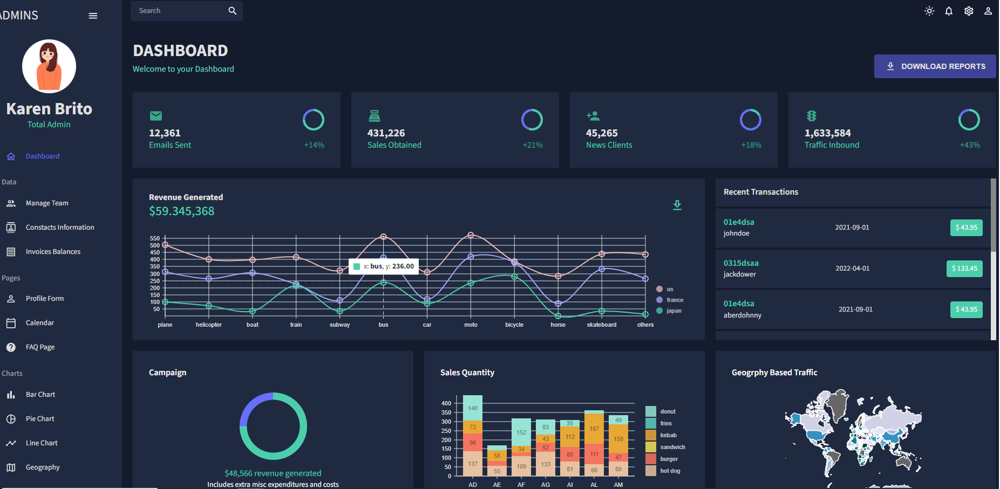

<h1 align="center">Dashboard Admin</h1>

<div align="center">
  <h3>
    <a target="_blank"  href="https://dashboard-admin-react123.netlify.app/">
      Demo
    </a>
    <span> | </span>
    <a target="_blank" href="https://github.com/KaritinaBrito/dashboard-app-react">
      Code
    </a>
  </h3>
</div>

<!-- TABLE OF CONTENTS -->

## Table of Contents

- [Overview](#overview)
- [Built With](#built-with)
- [Features](#features)
- [How to use](#how-to-use)
- [Contact](#contact)
- [Acknowledgements](#acknowledgements)

<!-- OVERVIEW -->

## Overview



Page that allows you to navigate between different pages, with independent components, with the option of dark and light mode for the user's choice and with consumption of json files. Different libraries are used for optimization such as: Nivo, Material Mui, formik, fullcalendar, etc.

### Built With

<!-- This section should list any major frameworks that you built your project using. Here are a few examples.-->

- [React](https://reactjs.org/)

## Features

## How To Use

<!-- Example: -->

To clone and run this application, you'll need [Git](https://git-scm.com) and [Node.js](https://nodejs.org/en/download/) (which comes with [npm](http://npmjs.com)) installed on your computer. From your command line:

```bash
# Clone this repository
$ git clone https://github.com/KaritinaBrito/dashboard-app-react

# Install dependencies
$ npm install

# Run the app
$ npm run dev
```

## Acknowledgements

<!-- This section should list any articles or add-ons/plugins that helps you to complete the project. This is optional but it will help you in the future. For example: -->

## Contact

- GitHub [@your-username](https://github.com/KaritinaBrito)
